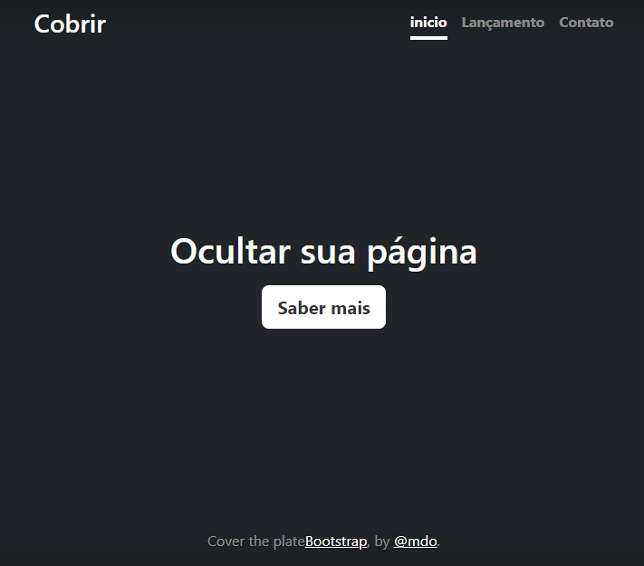

# Índice 

[Projeto de portfolio pessoaal](#portfolio-pessoal)  
[Descrição](#descri%C3%A7%C3%A3o)  
[Introdução](#introdu%C3%A7%C3%A3o)  
[Funcionalidades](#funcionalidades)  
[Tecnologias utilizadas](#tecnologias-utilizadas)  
[Fontes consultadas](#fontes-consultadas)  
[Autores](#autores)  

# Portfolio-Pessoal
Projeto criado utilizando exemplo do bootstrap para ensino de uso do README 

## Descrição
    O Portifólio Pessoal é um projeto realizado que foi realizado em sala para melhora do uso do README.
## Introdução
Neste projeto aprendemos a utilizar o Bootstrap e também a desenvolver nossa habilidade na construção do README.
 Bootstrap é um framework web com código-fonte aberto para desenvolvimento de componentes de interface e front-end para sites e aplicações web, usando HTML, CSS e JavaScript, baseado em modelos de design para a tipografia, melhorando a experiência do usuário em um site amigável e responsivo.  
O arquivo README é muito importante para nossa aprendizagem e nosso desenvolvimento dentro e fora do colégio,em questão a objetivos futuros,como "trabalho".
## Funcionalidades
Criado uma página com as seguintes funções:Cobrir, Inicío, Lançamento, Contato, Ocultar sua Página.
Fora que ao entrar na página pode ser escolhido a opção de traduzir para Português uma logo que fica na parte 
inferior da página.  

### Tecnologias utilizadas 
nesse Projeto usamos:
* ``HTML``
* ``CSS``
* ``VSCODE``
* ``Bootstrap``
* ``GitHub``
* ``Git``

## Fontes consultadas
* [Alura](https://www.alura.com.br/artigos/escrever-bom-readme) - Como escrever um README incrível no seu Github
 * [Gits Github](https://gist.github.com/lohhans/f8da0b147550df3f96914d3797e9fb89) -modelo para fazer um bom README

## Autores
executado por Rayssa Rafaelly Kopinski com orientação do Professor Leonardo Rocha.
